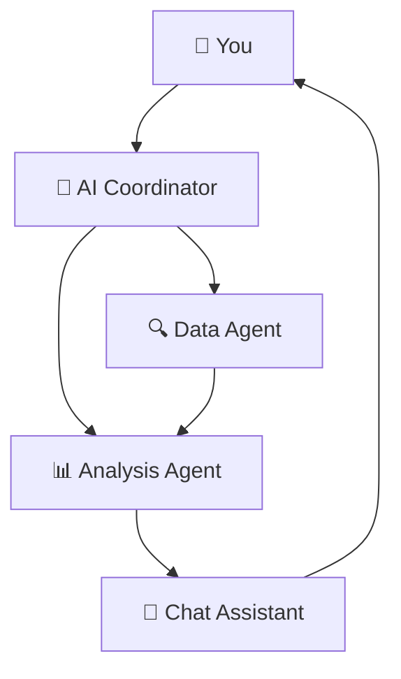

# 🤖 Finmate: Multi-Agent AI Financial Advisor  

  
  
  
  

---

## 🎯 Our Mission  
Financial planning should not be a luxury.  
Yet, **billions of people worldwide struggle with budgeting, debt, and savings**, while professional financial advice remains expensive, generic, and inaccessible.  

**Finmate is an AI-powered personal finance companion that brings personalized, data-driven financial guidance to everyone — anytime, anywhere.**  
 

## 🌍 The Real-World Problem  

- **Financial Stress:** One of the top causes of anxiety globally  
- **Lack of Guidance:** Many people don’t know where to start with budgeting, saving, or investing  
- **High Cost:** Professional advisors are too expensive for most individuals  
- **No Personalization:** Generic advice fails to consider unique financial goals  
- **No Continuity:** Existing tools don’t remember past progress or adapt over time  
 

## 💡 Our Solution: Finmate  

Finmate uses **multi-agent AI architecture** to act like a 24/7 financial mentor that:  

✅ Understands your unique financial situation  
✅ Gives actionable, personalized recommendations  
✅ Tracks your progress over time  
✅ Educates you to improve your financial literacy  
✅ Is **free, always available, and scalable worldwide**  
 

| Component         | Technology        |
| ----------------- | ----------------- |
| **AI Engine**     | Google Gemini Pro |
| **Backend**       | Python + AsyncIO  |
| **Database**      | MongoDB Atlas     |
| **Frontend**      | Streamlit         |
| **Visualization** | Plotly + Pandas   |

 

## 🏗️ How It Works  

 

## 🤖 AI Agents at Work
- Data Agent → Cleans & validates user financial data
- Analysis Agent → Calculates health score, goals, & insights
- Chat Assistant → Gives personalized, human-like guidance
- Coordinator → Makes all agents work together seamlessly

## 🚀 Powered by Google Technology
- Gemini Pro: Natural language understanding + reasoning
- MCP (Model Context Protocol): Maintains history & context across sessions
- Agent-to-Agent Communication: Enables specialized agents to collaborate in real time

## ✨ Key Features
- 🔐 Secure Profiles – Your data stays private & encrypted
- 📈 Persistent Tracking – Monitors spending, savings, and goals
- 🎯 Personalized Advice – Context-aware recommendations
- 📊 Interactive Dashboard – Beautiful visualizations for clarity
- 🧠 Learning & Insights – Teaches you to make better financial decisions

  
